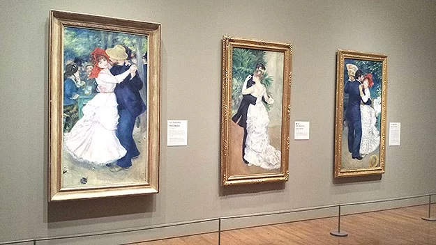
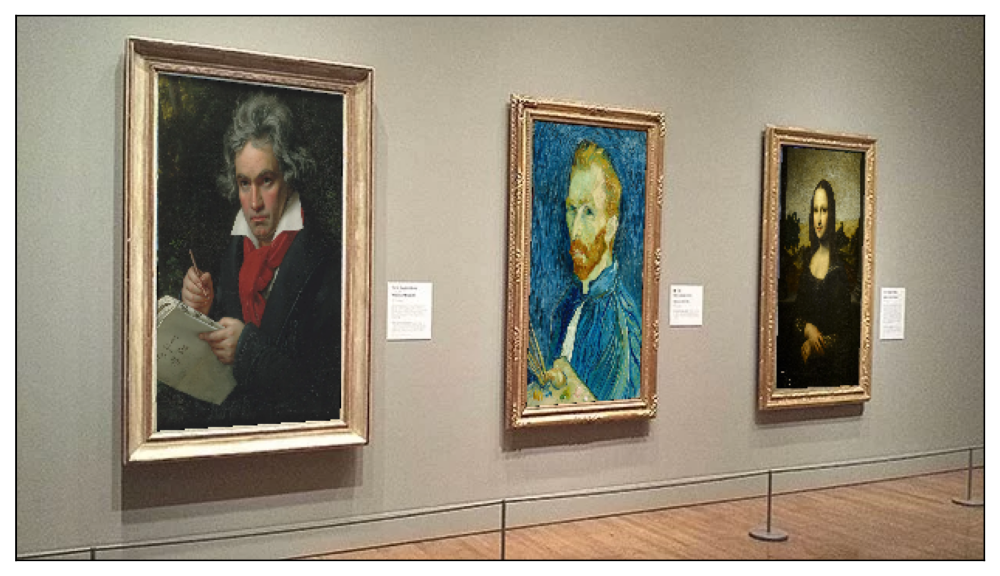

# HW1: Projective Geometry and Homography

## Affine Rectification (30 points)
**Rectified images and intermediate images with color coded annotation can be seen below:**

 

**Angle evaluation**

**Algorithm**

An affine transform preserves the line at infinity. We can rectify the effects of a general projective transform upto an affine transform 

## Metric Rectification (40 points)

**Output Images: Rectified images and intermediate images with color coded annotation can be seen below:**

**Angle evaluation**

## Planar Homography from Point Correspondences (30 points)

**Output Images: Warped images and intermediate images with point annotations can be seen below:**

## Bonus: More Planar Homography from Point Correspondences (10 points)

**Input Images:**

**Perspective Image:**

**Output**

